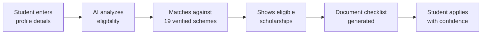

<div align="center">

# 🎓 TN Engineering Scholarship Finder

### AI-powered scholarship discovery for Tamil Nadu engineering students

[](https://tn-scholarship-finder.streamlit.app/)


**[🚀 Try Live App](https://tn-scholarship-finder.streamlit.app/)** · **[Report Bug](https://github.com/princemittalr/tn-scholarship-finder/issues)** · **[Request Feature](https://github.com/princemittalr/tn-scholarship-finder/issues)**

</div>

---

## 🔍 The Problem

Every year, thousands of Tamil Nadu engineering students **miss out on scholarships they actually qualify for.**

- Government scholarship info is buried in long PDFs and multiple portals
- First-generation students have no parent or mentor to guide them
- Information exists in English only — inaccessible to many rural students
- Students don't know what documents to prepare until it's too late

**The result:** Eligible students lose lakhs of rupees in scholarship money — simply because they didn't know it existed.

---

## ✅ The Solution

A free, multilingual AI chatbot that:

- Asks for your category, income, marks, and gender
- Instantly shows **every scholarship you qualify for**
- Gives you the **exact documents** you need to apply
- Works in **English, Tamil, and Hindi** — zero English required
- Highlights **urgent deadlines** so you never miss an application

> *"Just tell me your details — I'll find the money."*

---

## 🌟 Features

| Feature | Description |
|---|---|
| 🤖 AI-Powered Matching | Analyzes your profile and finds all eligible scholarships |
| 🌐 Multilingual | Full support for English, Tamil (தமிழ்), and Hindi (हिंदी) |
| 📋 Document Checklist | Auto-generates combined document list for all eligible schemes |
| ⏰ Deadline Alerts | Highlights scholarships closing soon |
| 📱 Mobile Friendly | Works on any device, no installation needed |
| 🆓 Completely Free | No login, no payment, no ads — ever |

---

## 📊 Scholarship Coverage

### Central Government (via scholarships.gov.in)
- AICTE Pragati Scholarship (Girl Students) — up to ₹50,000/year
- AICTE Saksham Scholarship (Specially Abled) — ₹50,000/year
- AICTE Swanath Scholarship (Orphan/COVID-affected) — ₹50,000/year
- NSP Post-Matric — SC / ST / OBC / Minority students

### Tamil Nadu Government
- TN Free Education Scholarship BC/MBC/DNC — up to ₹2 lakh/year
- TN Post-Matric Scholarship SC / ST / BC/MBC/DNC
- TN First Generation Graduate Scholarship
- TN Adi Dravidar & Tribal Welfare Scholarships
- TN Scholarship for Differently Abled Students
- TN HESS Scholarship for ST students

### Private & Foundation
- IDFC FIRST Bank Scholarship — up to ₹1 lakh/year
- NHFDC Scholarship for Disabled Students
- NSP Top Class Education (IIT/NIT/IIIT students)

> **19 verified scholarships** · Data verified June 2026 · Always verify deadlines at official portals

---

## 🚀 How It Works



---

## 🖥️ Run Locally

```bash
# 1. Clone the repository
git clone https://github.com/princemittalr/tn-scholarship-finder.git
cd tn-scholarship-finder

# 2. Install dependencies
pip install -r requirements.txt

# 3. Set your Groq API key (free at console.groq.com)
export GROQ_API_KEY="your_key_here"

# 4. Run the app
streamlit run app.py
```

---

## 🛠️ Tech Stack

| Layer | Technology |
|---|---|
| Frontend | Streamlit |
| AI Model | LLaMA 3.3 70B via Groq API |
| Language | Python 3.10+ |
| Hosting | Streamlit Cloud (Free) |
| Data | Manually verified from official government portals |

---

## 🎯 Who Is This For?

- 🎓 Engineering students in Tamil Nadu (any year)
- 👨‍👩‍👧 First-generation college students with no guidance
- 🌾 Rural students who need information in Tamil or Hindi
- 📚 Students who applied to one scholarship but missed others they qualify for

---

## 🌍 Social Impact

This tool was built specifically for **first-generation engineering students** — students whose parents never went to college and have no one to guide them through the scholarship process.

In India, eligible students lose crores in scholarship money annually — not because they don't qualify, but because **they don't know the money exists.**

This tool changes that.

---

## 📁 Project Structure

```
tn-scholarship-finder/
├── app.py              # Main Streamlit application
├── requirements.txt    # Python dependencies
└── README.md           # This file
```

---

## 🤝 Contributing

Contributions are welcome. If you know of a scholarship not listed here:

1. Fork the repository
2. Add the scholarship details in `app.py` under `SCHOLARSHIP_DATA`
3. Include: name, eligibility, amount, deadline, website, documents needed
4. Submit a pull request

Please verify all data from **official government websites only.**

---

## ⚠️ Disclaimer

Scholarship data is verified as of **June 2026**. Deadlines and eligibility criteria change annually. Always verify at official websites before applying:
- [scholarships.gov.in](https://scholarships.gov.in)
- [bcmbcmw.tn.gov.in](https://bcmbcmw.tn.gov.in)
- [dte.tn.gov.in](https://dte.tn.gov.in)

---

## 👨‍💻 Author

**Prince Mittal**
B.Tech CSE (AI/ML) · Dayananda Sagar University

[](https://linkedin.com/in/princemittalr)
[](https://github.com/princemittalr)

---

## 📄 License

MIT License — free to use, modify, and distribute.

---

<div align="center">

**Built with ❤️ for students who deserve better access to education funding.**

⭐ Star this repo if it helped you find a scholarship!

</div>
